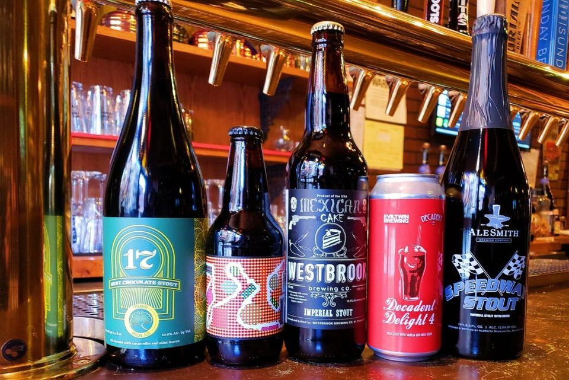
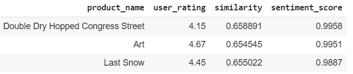
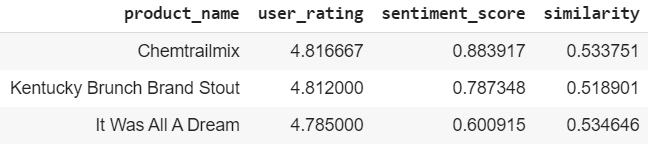

# Introduction
The objective of this project is to create the building blocks of a crowdsourced recommendation system. This recommendation system will accept user inputs about desired attributes of a beer and come up with 3 recommendations.

# Data Overview
We scraped reviews for the first 25 beers from "Top 250 rated beers" in Beeradvocate.com

# Approach
•	Data cleaning and pre-processing using NLTK 
•	Get user input for the attributes they want to see in a beer and use spacy similarity to find the beer with most relevant reviews 
•	Find sentiment score for all the relevant reviews using VADER 
•	Aggregate the sentiment and sort it to get the top 3 beers

# Results and recommendations
Below mentioned are the three beers that we would recommend to a person if fruity, robust and balanced are the attributes he is looking for in a beer 

And below are the three beers based only on their ratings

•	If we simply recommend based on maximum user rating without considering the sentiment score or similarity score, we will miss out on a relevant recommendation. As seen in the above table of top 3 recommendations based on just user rating, the sentiment and similarity score for the selected attributes is relatively low even though the user rating is high. For e.g.- Chemtrail mix is a spiced beer which falls under Hoppy category and is not the attribute we wanted. 
•	The previous beer recommendations made were based on similarity with the 3 selected attributes (Fruity, Robust and Balanced) and the general sentiment based on the comments. These recommendations will be well suited for a customer who keeps these 3 attributes as their top priority as both similarity and sentiment scores are very high. 
•	More generic and simply user rating-based recommendation would be best suited for customers who do not have any attribute preference or their preference is not known.
